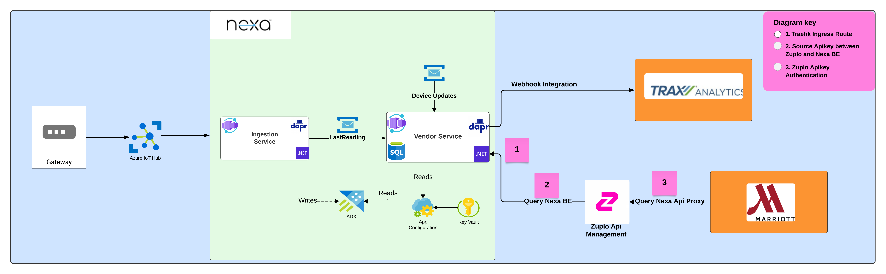

<h1 align="center">Nexa Platform APIM</h1>

  Built using Zuplo

  <h3>Related Repositories:</h3>
  <h3>
    <a href="https://github.com/Watts-Digital/nexa-api">
      Nexa Internal Api
    </a>
  </h3>

  

  Built with ❤︎ by
  <a href="">Watts Digital Engineering</a>
    contributors
  </a>

# System Level Architecture

# Release Runbook

Release runbook is a step-by-step guide that outlines the procedures to make a deployment. It includes instructions for pre-deployment checks, the deployment process, post-deployment verification.

The runbook can be found [here](./RUNBOOK.md)

